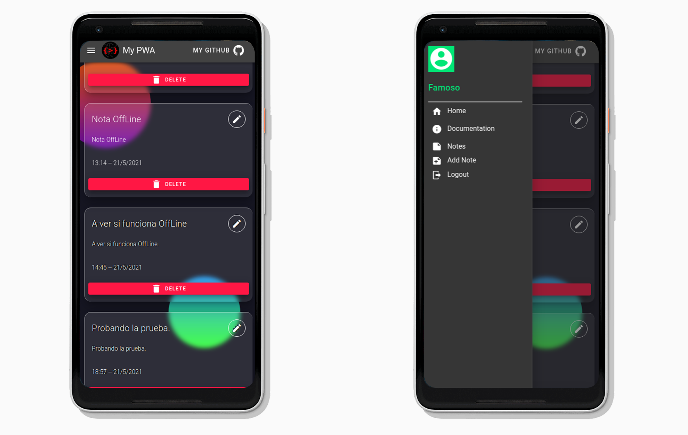

# My PWA
------------

***Device screenshot:***



## <i>Progressive Web Application</i> (PWA) developed with VueJS to create notes.

## Deployment in production:

### In the first place, for the app to work it is necessary that a REST API is also deployed as a backend of this application. Said backend can be viewed and/or downloaded from <a id="link-color" href="https://github.com/emarifer/my-pwa-backend" target="_blank" rel="noopener noreferrer">here</a>. Once this application is downloaded, you have to install the dependencies and compile it::
```
npm i
```
```
npm run build

// 1. Vue CLI must be installed.
```

### Once this is done we will deploy the application. For this purpose, a statics file server can be used.

### In some servers it may be necessary to create a <i>404.html</i> with the same content as the <i>index.html</i> so that it does not give us an error when doing a fallback in the browser. This <i>404.html</i> file is created automatically when compiling the application.
